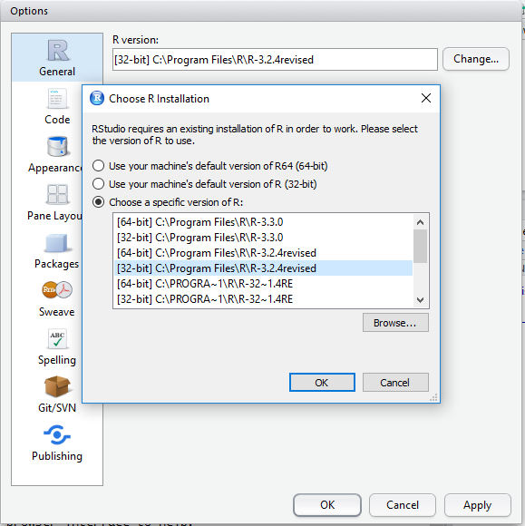

## R Studio

R Studio is an extremely popular interface to R that makes it much more pleasant to use.
It is also free!

### Exercise 1

* Download and install the desktop version of R Studio from https://www.rstudio.com/products/rstudio2/
* Watch the short video at https://www.rstudio.com/products/rstudio2/ to get an idea of what R Studio provides(You won't need sound).

### Changing the version of R linked to RStudio

When you install lots of versions of R, as we have been doing, we find it necessary to change the version of R that R Studio is linked to.
On Windows, we do this by launching RStudio and going to **Tools**->**Global Options**->**General** and clicking on **Change**

### Other applications required by RStudio

#### Reproducible Research

An R package called [Sweave](https://www.statistik.lmu.de/~leisch/Sweave/) allows you to embed executable R programs within [LateX](https://www.latex-project.org/) documents.
This allows you to produce automated, dynamic reports. It also allows scientists to produce documents that include their entire analysis pipeline, not just the results.
Other scientists can build-on and make use of these in a reproducible way.

RStudio supports the creation and compilation of Sweave documents.

#### Exercise 2

Go to **File**->**New File**->**R Sweave** to open a Sweave document.
Why can't you proceed?

#### Version control

A vital part of modern Research Software Engineering is version control and initiatives such as [Software Carpentry](http://software-carpentry.org/) work hard to ensure that all computational scientists make use of it.
RStudio supports version control.

#### Exercise 3

* Go to **File**->**New Project**
* Click on **Version Control**
* Click on **Git**

Why can't you proceed?

The point of these exercises is to show that R doesn't exist in a vacuum. A properly functioning R installation requires several different applications to be installed.

### Exercise 4

As an excuse to spend some time in RStudio, we'll learn some more basic R commands. Work through the sections below, entering the commands into RStudio.

## Variables

We'll rarely want to perform a calculation and throw away the result. It is much more likely that we'll want to store the result in R's memory for later use; either as part of future calculations or ready for export to external files.

We do this by assigning the results of calculations to variables.  For example,

    a <- sin(1)
    b <- 10
    c <- a+b

In the above, we created three variables called *a*, *b* and *c*.
Note that as you create variables, they are shown, along with their values, in RStudio's **Environment** window.
You can also list all **variable names** that currently exist in R's memory using the command

    ls()

To see the value of any given variable, just type it's name followed by enter

    c

To remove a variable from R's memory, we use the **rm()** command

    rm(c)

The `rm` command can also remove a list of variables in one go. For example, we could remove **all** variables in R's memory by sending the results of **ls()** to it.

    rm(list=ls())

## Built in datasets

R comes with a package called **datasets** that contains a set of classic datasets such as [Fisher's Iris data](https://en.wikipedia.org/wiki/Iris_flower_data_set) and [Anscombe's quartet](https://en.wikipedia.org/wiki/Anscombe%27s_quartet). This package is one of the few that are loaded when you start R.

To see the full list of available datasets, execute the command

    library(help="datasets")

We are going to focus on the iris dataset which is stored as an R object called a Data Frame in the variable name `iris`. Learn more about this dataset using the `help` command:

    help(iris)

If you run the above command, you'll see that R's documentation tells us that *"iris is a data frame with 150 cases (rows) and 5 variables (columns) named Sepal.Length, Sepal.Width, Petal.Length, Petal.Width, and Species."*

Let's confirm this information for ourselves by introducing a few more R commands. `dim()` tells us the dimensions of a data frame

    dim(iris)

The `names()` function tells us the column names of a data frame.

    names(iris)

We can extract any of the columns by name using the `$` operator. To get a list of the petal lengths for example we do

    iris$Petal.Length  

The `str()` function gives a compact summary of the structure of its input

    str(iris)

The `head()` function shows us the first 6 data points.

    head(iris)

You could display the entire data frame by simply entering

    iris

Alternatively, we can obtain some summary statistics about this data frame using the `summary()` command

    summary(iris)

## Plotting data

Let's extract the columns Petal.Length and Petal.Width and plot them against each other

    x = iris$Petal.Length
    y = iris$Petal.Width
    plot(x,y)

We add axis labels and titles by supplying named arguments to the plot command

    plot(x,y,xlab="Petal Length",ylab="Petal Width",main="Iris Data")

Each datapoint has an iris species associated with it - one of setosa, versicolor and virginica. We can see this by asking R what the structure of the `iris$Species` column is

    str(iris$Species)

Factors are how R represent [categorical variables](https://en.wikipedia.org/wiki/Categorical_variable). We can see what the factor levels are with

    levels(iris$Species)

We can include this information on the plot by coloring each datapoint according to its species.

    plot(x,y,xlab="Petal Length",ylab="Petal Width",main="Iris Data",col=iris$Species)

 Finally, let's add a legend

    plot(x,y,xlab="Petal Length",ylab="Petal Width",main="Iris Data",col=iris$Species)
    legend(x = 1, y = 2.5, legend = levels(iris$Species), col = c(1:3), pch=1)
