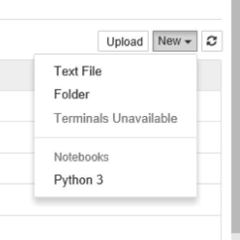
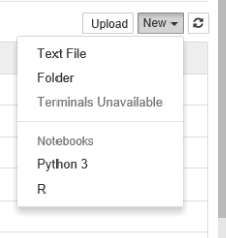

# Project Jupyter

The [Jupyter notebook](http://jupyter.org/) was originally called IPython notebook which was a browser-based interface for Python. It has since turned into a browser-based interface for many languages including (**JU**)lia, (**PYT**)on (**E**)t **R**.

It has become extremely popular in the data science community. A recent prominent example of its use was the release of code and data relating to the [gravitational waves discovery](https://www.theguardian.com/science/2016/feb/11/gravitational-waves-discovery-hailed-as-breakthrough-of-the-century) - all of which was [released as a Jupyter Notebook](https://losc.ligo.org/s/events/GW150914/GW150914_tutorial.html).

## Installing the Jupyter notebook with R kernel

Project Jupyter is written in Python so we first need to install Python. The recommended version is Anaconda Python.

* Install Anaconda Python 64 bit. Either 2.7 or 3.5 is fine. https://www.continuum.io/downloads
* Launch the Juptyter notebook. You can either use the start menu item or enter `jupyter notebook` in a CMD prompt
* The first step to opening a new notebook is to click on **New** on the top right hand side of the notebook interface. Note that the only kernel that is available is Python.

* We need to install the connector between R and the notebook. This is provided by an R package called [IRkernel](https://github.com/IRkernel/IRkernel). IRkernel is not yet available on CRAN so we need to install it directly from github.

Open the latest version of R and enter the following commands

    install.packages(c('pbdZMQ', 'repr', 'devtools'))  # repr is already on CRAN
    devtools::install_github('irkernel/IRdisplay')
    devtools::install_github('irkernel/IRkernel')
    IRkernel::installspec()  # to register the kernel in the current R installation

Close R and open the Jupyter notebook interface again. Now, when you click on **New** you should also have the option to open an R notebook.

## Exercise

Open a new Jupyter notebook with an R kernel and execute the following command to download an example notebook.

    download.file('https://github.com/mikecroucher/R_awareness/blob/master/code/section4/R-notebook-example.ipynb','./R-notebook-example.ipynb')
