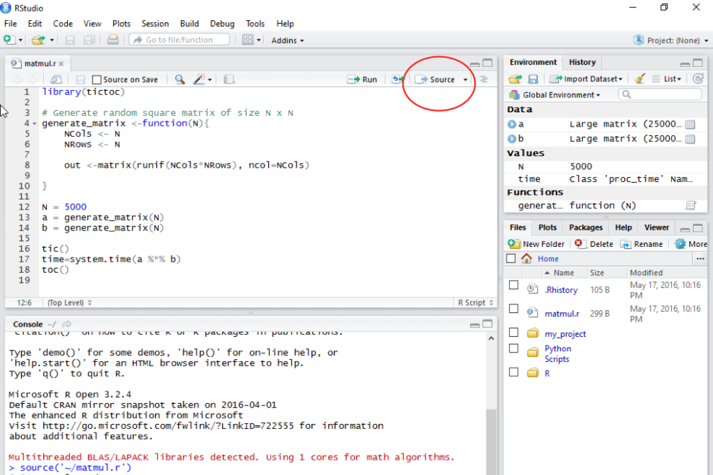

# Microsoft R Open - An enhanced version of R

Revolution Analytics were a small company who, among other things, produced an enhanced version of R. They have since been purchased by Microsoft who use this version of R in their cloud based data-analytics services within Azure (see http://blog.revolutionanalytics.com/2016/03/ds-vm-update.html for example)

There is a free version of this enhanced version of R available - Microsoft R Open (previously Revolution R Open).

Microsoft R Open is available for Linux, Mac OS X and Windows and is fully compatible with the standard, community version of R we've been using all day.

It can be installed alongside 'traditional' R.

## Exercise

* Download and install Microsoft R Open from https://mran.revolutionanalytics.com/download/. Ensure that you install the MKL Math library component as well.

## Faster Linear Algebra

One of the enhancements provided by Microsoft R Open is that it makes use of the [Intel Math Kernel Library (MKL)](https://software.intel.com/en-us/intel-mkl). This is a highly optimised linear algebra library that's also used by products such as MATLAB and Mathematica.

The practical upshot is that many operations involving functions on matrices are significantly faster in Microsoft R Open.

Although this seems to be a rather limited scope, it has the potential to accelerate many commonly performed calculations in R.

A full discussion is beyond the scope of this tutorial but the following exercise will give you an idea of the potential speed benefits.

## Exercise Matrix-Matrix Multiply

Multiplying matrices together is a very common operation in scientific computing. 

* Open R Studio and ensure that it is using Microsoft R Open (See [Section 3](./Section3.md) for details on how to swap R version if you need it.
* In R Studio, execute the command

```
download.file(
'https://github.com/mikecroucher/R_awareness/raw/master/code/section6/matmul.r',
'./matmul.r')
```
This downloads a program that generates two 5000x5000 matrices and multiplies them together.
* Open the file matmul.r in RStudio by clicking on it in the **Files** pane
* Run it by clicking on **source** in the **matmul.r** window




