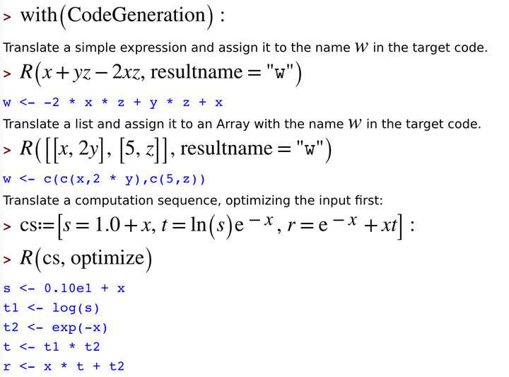

# How R relates to other applications

This is a brief description of how R relates to other site licensed applications at both University of Manchester and University of Sheffield.

#Maple 

Maple is a site licensed computer algebra system. Staff and students can install it on personal and University-owned machines.

* Maple can generate R code from Maple expressions.

# R Tools for Visual Studio

* A free plug-in for Visual Studio that provides support for R. 
* Download at https://www.visualstudio.com/en-us/features/rtvs-vs.aspx

