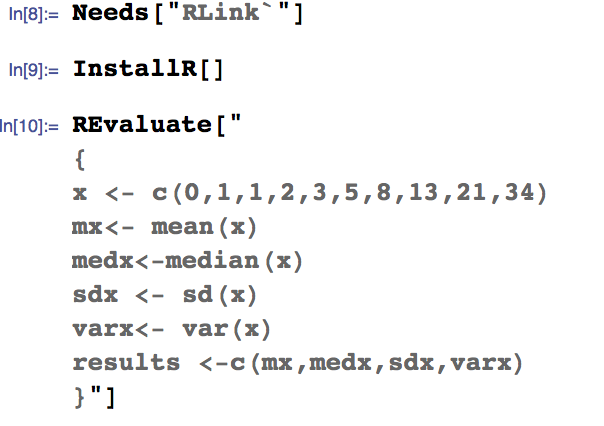

# How R relates to other applications

This is a brief description of how R relates to other site licensed applications at both University of Manchester and University of Sheffield.

# Excel

There are lots of ways of interacting with Excel using R. I don't know much about them. Here's one approach that looks promising

* http://altons.github.io/r/2015/02/13/quick-intro-to-xlconnect/

# Maple 

[Maple](http://www.maplesoft.com/solutions/education/) is a commercial computer algebra system that is site licensed at Sheffield and Manchester. Staff and students can install it on personal and University-owned machines.

* Maple can [generate R code from Maple expressions](http://www.maplesoft.com/support/help/Maple/view.aspx?path=CodeGeneration%2fR).

# Mathematica

Mathematica is a commercial computer algebra system that is site licensed at Sheffield and Manchester. Staff and students can install it on personal and University-owned machines.

Mathematica has an in-built interface to R: [RLink](https://reference.wolfram.com/language/RLink/guide/RLink.html)

It allows you to combine R code with Mathematica code.

# R Tools for Visual Studio

* A free plug-in for Visual Studio that provides support for R. 
* Download at https://www.visualstudio.com/en-us/features/rtvs-vs.aspx

# NAG Library
The Numerical Algorithms Group (NAG) Library is a commercial numerical library containing 1700+ functions. It is site licensed for use by staff and students at Manchester and Sheffield.
 It's written in C and Fortran and can be used in R
 

# Origin Pro

OriginPro is a commercial plotting and data analysis package. Manchester has a site license for it.

http://www.originlab.com/doc/LabTalk/guide/LT-Running-R